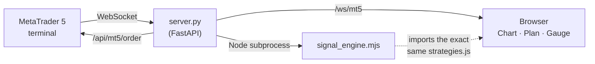

<div align="center">

# 🧠 TradingAgents

### The Multi-Agent Trading Room

**AI analyst team + a live 25-strategy engine + zero-lag MetaTrader 5 streaming — in one desktop app.**

[](https://github.com/AmirGhl/TradingAgents/releases/latest)

[](LICENSE)
[](https://github.com/AmirGhl/TradingAgents/releases/latest)
[](pyproject.toml)
[](webui/frontend)
[](webui/signal_engine.mjs)

**[⬇ Download for Windows](https://github.com/AmirGhl/TradingAgents/releases/latest)** &nbsp;·&nbsp;
**[📘 Quick start (Persian)](README_FA.md)** &nbsp;·&nbsp;
**[🛠 Full architecture guide](RAHNAMA.md)** &nbsp;·&nbsp;
**[🗺 Roadmap](ideas/)**

</div>

<br>

> [!WARNING]
> This is a research tool, not financial advice. No signal is guaranteed. Every strategy, live signal, and auto-execution row starts **safe by default** — see [Shadow mode](#-shadow-mode-prove-it-before-you-trust-it) below.

---

## What is this?

TradingAgents stacks three independent layers into one window:

1. **🤖 Multi-agent AI analysis** — a team of LLM agents (market, news, fundamentals, sentiment) debate a symbol; a risk manager and portfolio manager turn the debate into one decision with entry / stop-loss / targets.
2. **🎯 A live 25-strategy engine** — classic technical strategies (EMA cross, RSI, Bollinger, SuperTrend, Ichimoku, ORB, VWAP scalps, …) run independently of the AI, directly on live candles, each with automatic backtesting and a combined-vote gauge.
3. **🔌 Zero-lag MetaTrader 5 integration** — when the terminal is open, price and candles stream straight from the account over a WebSocket (~7 updates/second); orders go out one-click or fully automated, with a shadow (paper) mode to prove a setup before real money touches it.

Built for a solo trader who wants AI-grade analysis *and* battle-tested classic strategies sitting next to their real broker account, in one tool, with nothing extra to install.

---

## ✨ Highlights

| | |
|---|---|
| 🔌 **No-lag live data** | A WebSocket tick stream reads straight from the open MetaTrader terminal — price is the broker's real **bid**, and the forming candle is the terminal's own, not synthesized. Terminal closed? It falls back to Yahoo Finance automatically and upgrades back to live the instant the terminal reopens. |
| 🎯 **25 strategies, one shared brain** | From the golden cross to a 1-minute VWAP scalp — each with rules, an automatic backtest, and computed entry/SL/TP. The chart banner and the plan tab **always agree**, because both read from one engine and one data feed. |
| ⏸ **Neutral means no trade** | A signal only counts as fresh for a few bars after it fires. Past that, no entry line, no trade button — just a note on when the last signal happened. You can never accidentally trade a stale setup. |
| 📊 **Spread-aware backtesting** | Backtests account for the real bid/ask cost of entering and exiting, surfacing a "net-after-spread" R that can reveal a chart-positive strategy is actually a loser once the spread is paid. |
| 🌓 **Auto-execution — shadow first** | Arm any strategy on any symbol; the server evaluates it against live broker candles with no browser tab open. Every row starts in **shadow mode** — a hypothetical fill logged at the real bid/ask, zero real orders — until you explicitly flip it live. |
| 🛡 **Safety guards on every order** | Daily loss cap, automatic trailing stop, news blackout windows, currency-exposure cap, broker minimum-stop-distance compliance, free-margin check — all enforced before a single order is sent. |
| 🤖 **Risk preview, every time** | "If the stop hits: −$X, Y% of equity" — computed from the broker's real tick value, not a guess. A real (non-demo) account turns the whole panel red so it's never mistaken for a demo. |
| 📲 **Two-way Telegram** | Analysis results and price alerts land in your bot; approve or reject a proposed trade right from your phone. |
| 📖 **The manual lives in the app** | A "?" button in the top bar explains every feature in plain language — no need to read code or docs to understand a panel. |

---

## 🚀 Quick start

### For traders (Windows, no install)

1. Grab the latest `TradingAgents-WebUI-*-win64.zip` from **[Releases](https://github.com/AmirGhl/TradingAgents/releases/latest)** and extract it.
2. Double-click `TradingAgentsLauncher.exe` — your browser opens on its own. Nothing else to install; Python and every dependency ship inside the `runtime/` folder.
3. Drop an LLM API key into Settings ⚙ (or point it at a free local [Ollama](https://ollama.com)), and/or connect your MetaTrader 5 account for live data and trading.

Full walkthrough: **[README_FA.md](README_FA.md)** (Persian) — or just click the **"?"** button once the app is open.

### For developers (from source)

```bash
git clone https://github.com/AmirGhl/TradingAgents.git
cd TradingAgents
pip install -e ".[webui]"
npm --prefix webui/frontend install
npm --prefix webui/frontend run build
python -m webui   # → http://127.0.0.1:8420
```

Auto-execution's headless signal engine runs under Node.js — install it separately if you want strategies to fire with no browser tab open. Everything else (chart, live signal, one-click trading) works without Node.

---

## 🏗 Architecture, at a glance



- **One source of truth for signals.** `strategies.js` runs in the browser *and*, unmodified, under Node in the server — so the chart, the plan tab, and the auto-execution engine can never disagree.
- **Backend:** a single-file FastAPI service (`webui/server.py`) — market-data endpoints, the guarded MT5 order path, and background loops (safety watchdog, trailing stop, auto-execution, Telegram).
- **Frontend:** React + `lightweight-charts`, with one shared live-signal hook (`livesignal.js`) and one shared WebSocket registry (`mt5stream.js`).
- **AI core:** a LangGraph multi-agent graph in `tradingagents/` — analysts → research debate → trader → risk team → portfolio manager.

Full file-by-file map, every endpoint, and every guard: **[RAHNAMA.md](RAHNAMA.md)**.

---

## 🌓 Shadow mode: prove it before you trust it

> [!TIP]
> Every armed strategy starts in shadow mode. Let it run for a few days, watch the shadow journal, and only flip a row to live once you've actually seen it work.

Auto-execution never sends a real order by default — it logs a *hypothetical* fill at the real live bid/ask into a shadow journal. Going live is an explicit, confirmed, per-strategy opt-in. It's the difference between a backtest's optimistic fantasy and proof against the real, moving market.

---

## 📋 Requirements

| | |
|---|---|
| **End user** | 64-bit Windows, internet connection. MetaTrader 5, installed and logged in, for live data and trading. |
| **Developer** | Python 3.10+, Node.js 18+ (frontend build + the headless engine), the `MetaTrader5` package (Windows-only) for live integration. |
| **Either way** | One LLM provider key (Anthropic, Groq, OpenRouter, …) — or a free local [Ollama](https://ollama.com) install. |

---

## 🙏 Built on

The multi-agent analysis core is built on the open-source **[TauricResearch/TradingAgents](https://github.com/TauricResearch/TradingAgents)** framework. This repository keeps that core and builds a full desktop web app on top of it: a live strategy engine, real-time MetaTrader integration, auto-execution with shadow mode, and safety guards throughout. Licensed under [Apache 2.0](LICENSE).

---

<div align="center">

TradingAgents is a research tool. Nothing in this repository is financial or investment advice.

</div>
